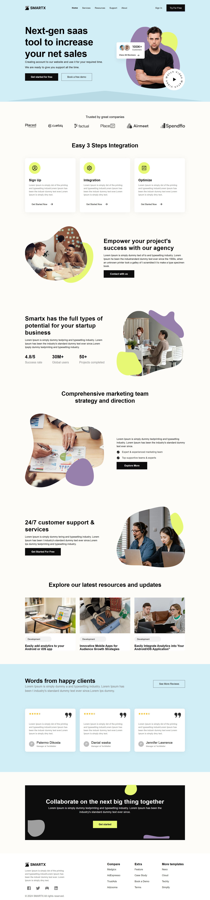

<h1>SMARTX — Modern SaaS Landing Page</h1>

SMARTX is a sleek and modern SaaS landing page designed to help businesses showcase their services and boost customer engagement. This design focuses on clean structure, persuasive sections, and professional styling that suits tech startups and SaaS companies.

<h2>:rocket: Key Features</h2>
<ul>
  <li>:white_check_mark: Next-gen SaaS tool showcase with engaging hero section.</li>
  <li>:white_check_mark: Customer trust badge highlighting over <strong>100K+</strong> happy users.</li>
  <li>:white_check_mark: Smooth and simple 3-step integration guide (Sign Up, Integration, Optimize).</li>
  <li>:white_check_mark: Project empowerment and startup-friendly sections.</li>
  <li>:white_check_mark: Dedicated customer testimonials and client reviews.</li>
  <li>:white_check_mark: Comprehensive marketing strategy highlights.</li>
  <li>:white_check_mark: 24/7 customer support focus area with strong CTA.</li>
  <li>:white_check_mark: Responsive and clean design for all devices.</li>
</ul>

<h2>:bulb: About This Project</h2>

This landing page was designed to provide startups and SaaS businesses with a professional first impression. It emphasizes trust, ease of use, and clear call-to-action buttons to help convert visitors into leads.

<h2>:technologist: How to Use</h2>
<ol>
  <li>Download or clone the repository from GitHub.</li>
  <li>Open the project in your code editor.</li>
  <li>Replace images and text content to match your business or product.</li>
  <li>Deploy using platforms like Vercel, Netlify, or GitHub Pages.</li>
</ol>

Feel free to contribute or suggest improvements!

<h2>:camera_with_flash: Full Page Screenshot</h2>

  

<h2>:camera_with_flash: Full Page Screenshot</h2>

  

